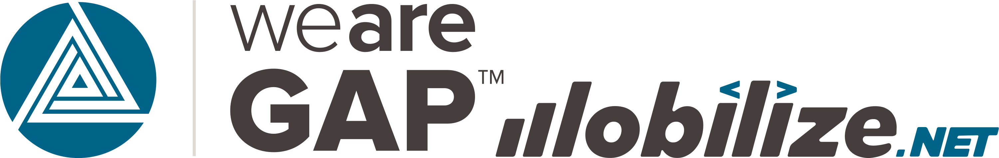

# MauiWorkshop
This is a workshop that Fritz is teaching online, introducing how to build your first mobile application.  In this workshop, you will learn how to build a simple news reader (RSS Reader) application.

RSS is a format and standard that is used across the web to publish news updates and podcast feeds for syndication.  Some news websites that publish RSS feeds include:

- [Microsoft Dev Tools Blogs](https://devblogs.microsoft.com) - ([feed](https://devblogs.microsoft.com/landingpage/))
- [The .NET SubReddit](https://www.reddit.com/r/dotnet) - ([feed](https://www.reddit.com/r/dotnet.rss))
- [Dev.To #dotnet tagged content](https://dev.to/t/dotnet) = ([feed](https://dev.to/feed/tag/dotnet))
- [NPR](https://npr.org) - ([feed](https://feeds.npr.org/1002/rss.xml))
- [TechCrunch](https://techcrunch.com) - ([feed](https://techcrunch.com/feed/))
- [The Verge](https://theverge.com) - ([feed](https://www.theverge.com/rss/index.xml))
- [Hollywood Reporter Live Feed](https://www.hollywoodreporter.com/e/live-feed/) - ([feed](https://www.hollywoodreporter.com/e/live-feed/feed/))
- [Rolling Stone](https://www.rollingstone.com/) - ([feed](https://www.rollingstone.com/feed/))
- [My Blog](https://jeffreyfritz.com) - ([feed](https://jeffreyfritz.com/feed))

We will build an application that will allow you to add newsfeeds like these, see notifications of new feed items, and view the content in a browser interface.

## Agenda

| Topics |
| ------ |
| Module 0 - [Introducing .NET MAUI](doc/0-Introduction/README.md) |
| Module 1 - [Layouts and Binding Data](doc/1-BindingData/README.md) |
| Module 2 - [Making this look good with STYLE](doc/2-Style/README.md) |
| Module 3 - [Saving Data Locally](doc/3-Data/README.md) |
| Module 4 - [The MAUI Shell](doc/4-TheShell/README.md) |
| Module 5 - [Navigation](doc/5-Navigation/README.md) |
| Module 6 - [WebView and Hybrid](doc/6-WebView/README.md) |

## Huge thanks to our promotional sponsors!

FREE .NET MAUI UI Component Library by DevExpress. Includes a Data Grid, Chart, Scheduler, and more (for both Android and iOS).

Iron Software develop enterprise backend component libraries for .NET. They are focusing R&D on key, cross platform backend components for MAUI.

Syncfusion delivers powerful MAUI data grids, charts, document processing libraries, and more for a complete developer toolkit.

