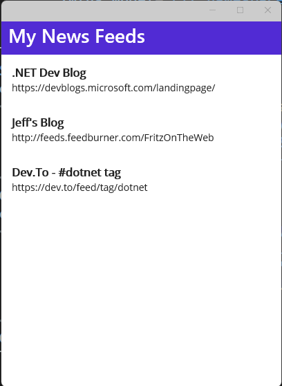

# Part 1 - Layouts and Binding Data

We've got the idea for our application, a News Reader, but how do we assemble the user interface?  We will want to use a layout to define the structure of our user-interface and we will want to bind data to views inside that layout to present the news feed content.

## Layouts


Layouts diagram courtesy of [Microsoft docs](https://learn.microsoft.com/dotnet/maui/user-interface/layouts/?view=net-maui-7.0)

.NET Multi-platform App UI (.NET MAUI) layout classes allow you to arrange and group UI controls in your application. Choosing a layout class requires knowledge of how the layout positions its child elements, and how the layout sizes its child elements. In addition, it may be necessary to nest layouts to create your desired layout.

For our application, we will prefer a StackLayout because not all RSS feeds are created with images and supporting content where a Grid or FlexLayout would help create a more interesting layout.



We'll start with a simple CollectionView that will use a StackLayout to present a list of feeds stacked vertically.

### Model

We will be downloading details about the newsfeed and will need a class to represent it.

RSS content will need to be downloaded from each feed and presented in the project.  It's preferred to have an object model representing the RSS feed and we can create one from a feed avaialble on the web, like my blog at `https://jeffreyfritz.com/feed` 

We can easily convert the xml content with the **Paste Special** feature in Visual Studio.  Copy the content of the XML file to your clipboard with Ctrl+C and select Edit - Paste Special - Paste XML as Classes. I have updated and made this content available for you as the RSS class in the project.

---
> **NOTE**

> After completing the demo, I realized there is a SyndicationFeed object and package available for .NET.  I will update the content of the workshop to use this standard object instead of the serialization I wrote

---

Let's also define the NewsFeed object we will work with in the project

1. Open `Models/NewsFeed.cs`
2. In `NewsFeed.cs`, copy/paste the properties:

```csharp
public record NewsFeed(string SourceUrl, string Title) {

	public NewsFeed() : this(string.Empty, string.Empty) { }

}
```

### Displaying Data

We can display hard coded data of any data type in a `CollectionView` in our `MainPage.xaml`. This will allow us to build out our user interface by setting the `ItemTemplate` with some simple images and labels. 

We first need to add a new namespace at the top of the `MainPage.xaml`:

```xml
xmlns:model="clr-namespace:MyNewsReader.Models"
```

This will allow us to reference the Monkey class above for data binding purposes.

Add the following into the MainPage.xaml's `ContentPage`:

```xml
	<CollectionView 
			SelectionMode="None">
		<CollectionView.ItemsSource>
			<x:Array Type="{x:Type model:NewsFeed}">
				<model:NewsFeed Title=".NET Dev Blog" SourceUrl="https://devblogs.microsoft.com/landingpage/" />
				<model:NewsFeed Title="Jeff's Blog" SourceUrl="http://feeds.feedburner.com/FritzOnTheWeb" />
				<model:NewsFeed Title="Dev.To - #dotnet tag" SourceUrl="https://dev.to/feed/tag/dotnet" />
			</x:Array>
		</CollectionView.ItemsSource>
		<CollectionView.ItemTemplate>
			<DataTemplate x:DataType="model:NewsFeed">
				<Label VerticalOptions="Center" TextColor="Gray">
						<Label.Text>
								<MultiBinding StringFormat="{}{0} | {1}">
										<Binding Path="Title" />
										<Binding Path="SourceUrl" />
								</MultiBinding>
						</Label.Text>
				</Label>
			</DataTemplate>
		</CollectionView.ItemTemplate>
	</CollectionView>

            </HorizontalStackLayout>
        </DataTemplate>
    </CollectionView.ItemTemplate>
</CollectionView>
```


If we wanted to display the  two strings vertically on top of each other, we could wrap two `Label` controls inside of a `VerticalStackLayout` and assign font sizes to stand out:


```xml
				<VerticalStackLayout Padding="15">
					<Label Text="{Binding Title}" FontSize="24" />
					<Label Text="{Binding SourceUrl}" FontSize="18" />
				</VerticalStackLayout>
```


### Run the App

Ensure that you have your machine setup to deploy and debug to the different platforms:

* [Android Emulator Setup](https://docs.microsoft.com/dotnet/maui/android/emulator/device-manager)
* [Windows setup for development](https://docs.microsoft.com/dotnet/maui/windows/setup)

1. In Visual Studio, set the Android or Windows app as the startup project by selecting the drop down in the debug menu and changing the `Framework`


2. In Visual Studio, click the "Debug" button or Tools -> Start Debugging
    - If you are having any trouble, see the Setup guides for your runtime platform
